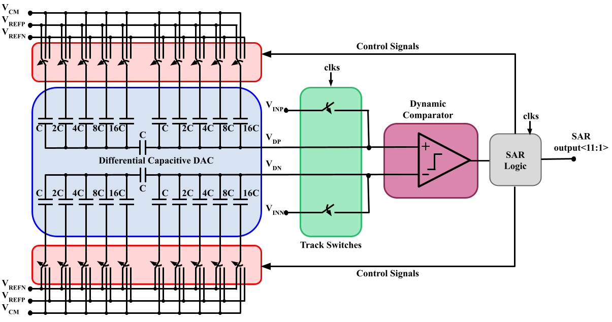
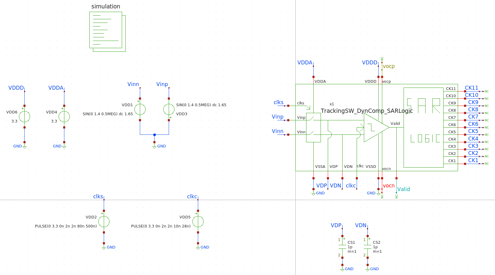

# 11-bit differential SAR ADC design

List and information of the members in charge of the design of the SAR ADC circuit.

|Name|Email|Affiliation|IEEE Member|SSCS Member|
|:--:|:--:|:----------:|:----------:|:----------:|
|Fredy Enrique Segura Quijano|fsegura@uniandes.edu.co|Universidad de Los Andes|Yes|No|
|David Alejandro Reyes Gonzales|darge3t.uis@gmail.com|HCL-Brazil|No|No|
|Juan Andrés Lopez Cubides|juan.andres.lopez491@gmail.com|Universidad de Los Andes|Yes|No|
|Ashutosh Kumar|kashiashu2000@gmail.com|Cochin University of Science and Technology|||
|Juan Sebastián Moya Baquero (Lead)  |jsmoya07@gmail.com|Universidad Industrial de Santander/Universidad de Los Andes|Yes|Yes|

## Introduction

The proposed ADC-SAR design is presented in the following figure.

The specifications that must be fulfilled are:

|Specification|Symbol|Baseline requirement|Comment|
|:--:|:--:|:----------:|:----------:|
|Sampling rate|fs|≥ 1.5MS/s|||
|Effective number of bits|ENOB|≥ 9|Measured near Nyquist|
|Input Capacitance|Cin|≤ 5pF||

We define the following values based on the architecture presented above:

- Vcm = Vdd/2​
- Vrefp = Vdd​
- Vrefn = 0

## Description and simulation results of the main blocks

The main blocks that integrate the design presented above are:

1) Differential Capacitive DAC (blue rectangle).
2) Switches for sampling (red rectangle).
3) Bridge Capacitor (horizontal capacitor in the differential capacitive DAC).
4) Switches for tracking (green rectangle).
5) Dynamic Comparator (purple rectangle).
6) SAR Logic (grey square).

### Differential capacitive DAC
The schematic of the capacitive DAC array comprises 10 capacitors connected in a bridged configuration to separate the most significant bits from the less significant bits. The unitary capacitor value is 100fF. (In progress to be optimized)

The corresponding symbol in xschem is presented below.

### Bootstrap tracking switch
The schematic of the Bootstrap tracking switch is illustrated below. The main goal of this configuration is to avoid surpassing the breakdown voltage of the transistors that compose the architecture used for tracking.

Follows the testbench for the Bootstrap tracking switch

The simulation results of Vgs and Vds for NMOS transistors and Vsg and Vsd for PMOS transistors that integrate the Bootstrap tracking switch are shown.

It is possible to observe that none of the voltage values exceed 4.1V, which is smaller than the breakdown voltages of the transistors. (In progress to be optimized)

### Dynamic Comparator
Then, the schematic of the dynamic comparator composed of the opamp, the latch, the two inverters, and the nand can be observed.

Additionally, the corresponding testbench with the 180 degrees out of phase two inputs VDN and VDP.

Then, the simulation results for vdn > vdp and vdp > vdn are presented to verify the adequate performance of the Dynamic Comparator.

In both simulation results it can be observed that when the circuit is operating during the reset phase (clkc = '0'), the outputs an and ap of the opamp take the value of '1' (both signals have the same offset in the simulations, an in green is over ap, which is in pink). On the contrary, dp and dn take the value of '0'.
During the regeneration phase (clkc = '1'), when the input vdp is larger than vdn, the outputs of the latch dn and dp take the values '1' and '0', respectively. Whereas, when vdn is larger than vdn, dn and dp take the values '0' and '1', respectively.

### SAR Logic

The next three figures correspond to the flip-flop D used in the SAR logic, the SAR logic with the eleven flip-flops, and the testbench used to validate the performance of this block.

Schematic with the 11 Flip-Flops.

Corresponding testbench of the SAR Logic.

The simulation results of the SAR logic are illustrated below. All the outputs of the flip-flops take the '1' value when there are 11 consecutive positive edges of the Valid signal and clks is low. When clks is high, the outputs of the flip-flops (CKs) are reset.  

### SAR Asynchronous Logic
Finally, the following images validate the performance of the SAR Asynchronous Logic block. First, the corresponding schematic is composed of the two D Flip-Flops and the switches that set to '1' or '0' the bottom plate of the capacitors.

The corresponding testbench is presented.

Finally, we present the simulation results of the asynchronous logic. When the output vocp of the Dynamic Comparator is high, and dn=va=vb='1', the output of the asynchronous logic takes the low value. When the output vocp of the Dynamic Comparator is high, and dn=va=vb='0', the output of the asynchronous logic takes the high value. Finally, when vocp is low, the output of the asynchronous logic takes the value of Vcm= Vdd/2.

### Clock generator
The schematic of the asynchronous clock is presented.

The corresponding testbench can be observed below.

Then, the simulation results validate the behavior of the block.

## Integration of the blocks

### Bootstrap tracking switches - Dynamic Comparator - SAR Logic
Follows the testbench and simulation results of the integration of the blocks Bootstrap tracking switches - Dynamic Comparator - SAR Logic.

Then, the simulation results validating the behavior of this part of the SAR ADC are depicted.

### Integration of the SAR ADC
The testbench of the SAR ADC circuit is illustrated below.

